# Market Mate

Market Mate is an online marketplace application similar to OLX, designed to facilitate buying and selling of various products.

## Features

### 1. User Authentication and Authorization

- **User Registration and Login:** Users can sign up for an account by verifying through email or log in with their credentials.
- **User Roles:** Differentiates between buyers and sellers.

### 2. Product Listings

- **Create Listings:** Sellers can create product listings.
- **Product Categories:** Listings can be categorized for easy navigation.
- **View Listings:** Buyers can view all available listings.

### 3. Searching and Filtering

- **Search Bar:** Search functionality to find specific products.
- **Filtering Options:** Filters by category etc.

### 4. Product Details

- **Details View:** In-depth view of each product with images and description.
- **Contact Seller:** Option to contact the seller.

### 5. User Profiles

- **User Profiles:** Users can view their profiles and manage their listings.
- **Profile Editing:** Allows users to update their information.


## Technologies Used

- Python and Django for backend development.
- Django rest framework for API development.
- JavaScript, HTML and CSS for frontend.
- Database: MySql

## Setup and Installation


1. Clone the repository:

    ```bash
    git clone https://github.com/your-username/your-repo.git
    ```

2. Navigate to the project directory:

    ```bash
    cd your-repo
    ```

3. Install dependencies:

    ```bash
    pip install -r requirements.txt
    ```

4. Setup the database:

    ```bash
    python manage.py migrate
    ```

5. Start the development server:

    ```bash
    python manage.py runserver
    ```

## Screenshots

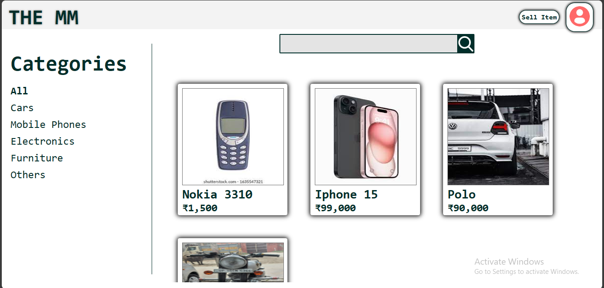
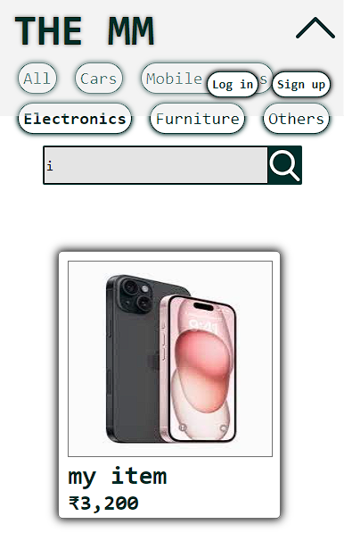
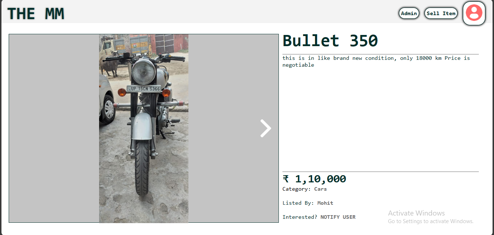
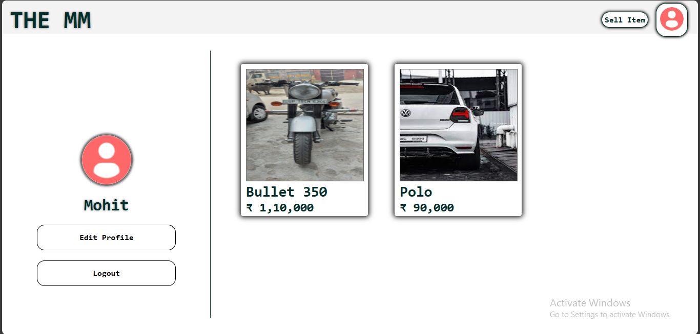
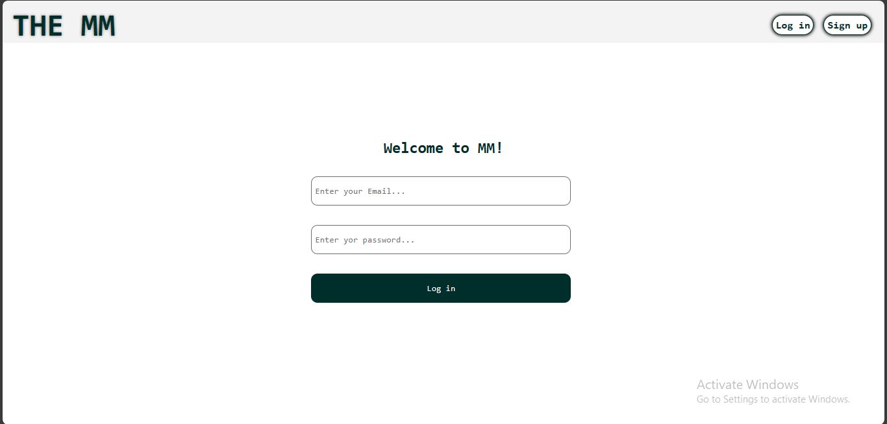
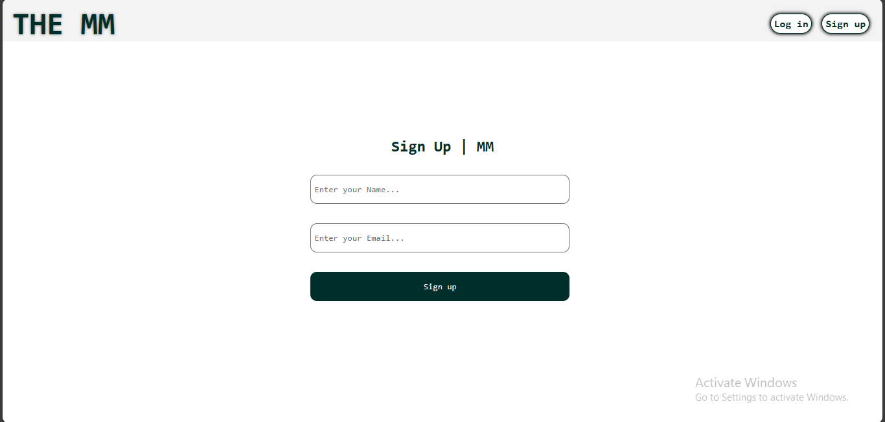

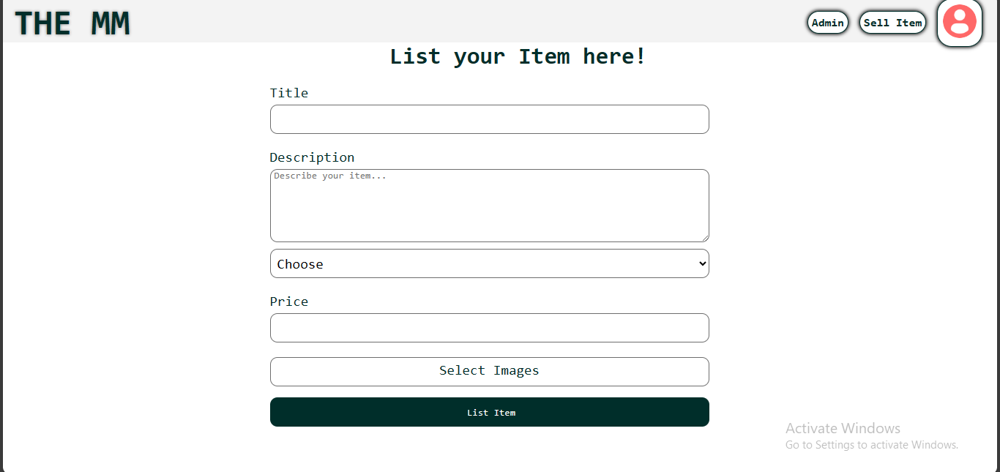
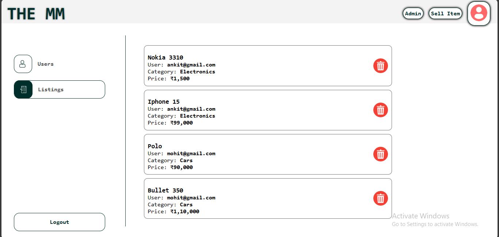
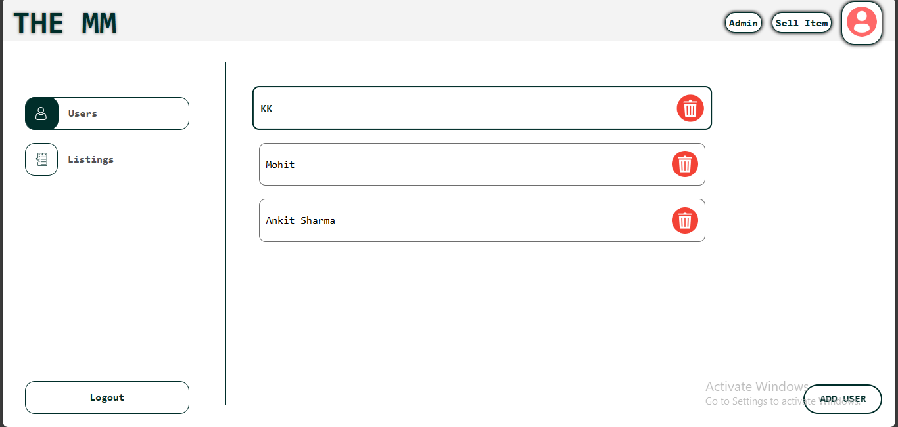
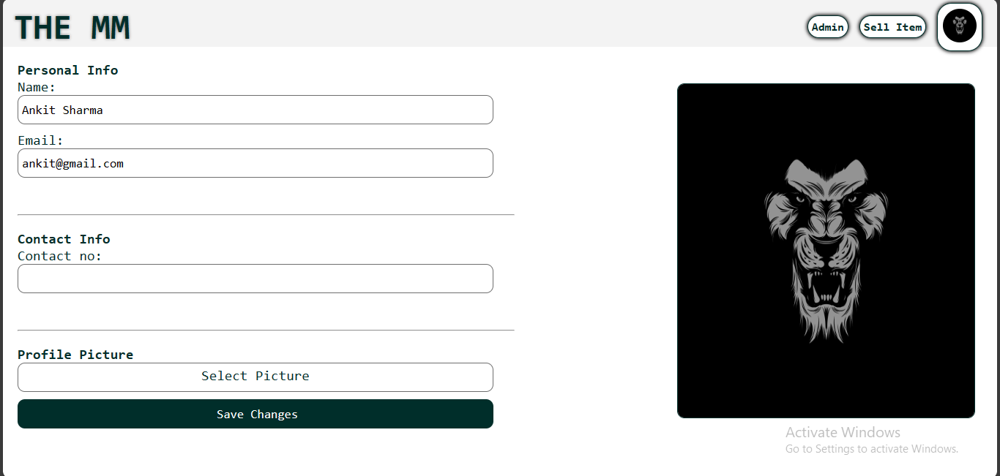
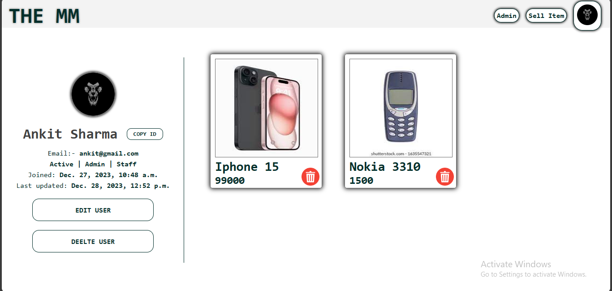


